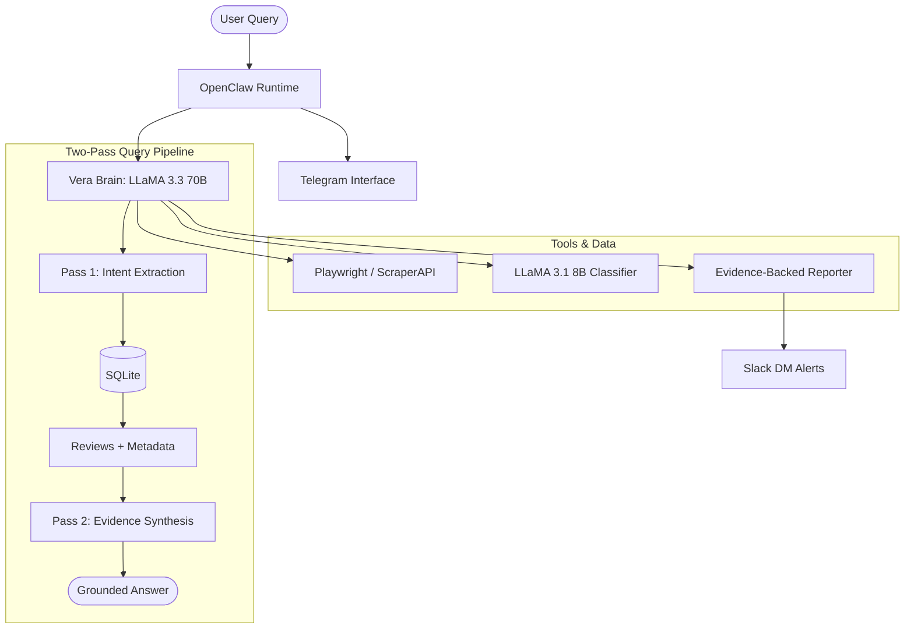

# Autonomous Voice of Customer (VoC) Intelligence Agent

## Overview

**Vera** is an autonomous AI agent that scrapes, classifies, and analyzes public e-commerce product reviews to generate actionable intelligence for Product, Marketing, and Support teams.

Built with a state-of-the-art reasoning stack:
- **Playwright**: High-fidelity DOM scraping and network interception for Flipkart.
- **ScraperAPI**: Reliable proxy-based scraping for Amazon.
- **Groq LLaMA 3.3 70B**: Two-pass reasoning pipeline for grounded queries and deeply reasoned reports.
- **Groq LLaMA 3.1 8B**: High-throughput NLP for sentiment and theme classification.
- **SQLite**: Structured storage for reviews, metadata, and scrape history.
- **Slack & Telegram**: Automated alerting and conversational interface.

Vera enforces strict anti-hallucination rules by citing exact review counts behind every claim and providing verbatim evidence.

---

## Agent Framework: OpenClaw

Vera runs on [OpenClaw](https://openclaw.ai) — an open-source autonomous agent runtime.

### Skills System
Vera's brain is composed of 5 core skills in the `skills/` folder:
1. `scrape-reviews.js`: Orchestrates Playwright/ScraperAPI runs.
2. `process-nlp.js`: Triggers bulk sentiment/theme classification.
3. `query-database.js`: Two-pass RAG-style query pipeline.
4. `get-statistics.js`: Generates frequency and sentiment metrics.
5. `generate-report.js`: Synthesizes departmental action reports.

### Quick Start with OpenClaw
```bash
# 1. Install & Onboard
npm i -g openclaw
openclaw onboard

# 2. Register Skills
openclaw skills add ./skills/*.js

# 3. Start Vera
openclaw start --config ./openclaw-config.json
```

---

## Architecture



---

## Features

### 🔍 Playwright-Powered Scraping
Vera uses Playwright to navigate Flipkart's complex DOM, overcoming traditional API blocks. It intercepts internal data and parses structured reviews directly from the page.

### 🧠 Two-Pass Reasoning Pipeline
Vera doesn't just "talk" to the database.
1. **Pass 1**: Extracts structured filters (theme, sentiment, product) from natural language.
2. **Execution**: Fetches exact matching records from SQLite.
3. **Pass 2**: Synthesizes a response using ONLY the fetched data, citing counts and quotes.

### 📊 Deeply Reasoned Reporting
Generated reports (Global & Weekly Delta) follow a strict **ACTION / BECAUSE / METRIC** format.
- **Product**: Root cause hypotheses for negative spikes.
- **Marketing**: Spontaneous praise language for copy optimization.
- **Support**: Frequency-ranked troubleshooting list.

### 🔔 Integrated Alerting
Automated Slack DM notifications after every report run, featuring auto-chunking for long reports and clean departmental segmentation.

---

## Setup

### Prerequisites
- **Python 3.10+**
- **Node.js 18+** (for OpenClaw)
- **Groq API Key** ([console.groq.com](https://console.groq.com))
- **ScraperAPI Key** ([scraperapi.com](https://www.scraperapi.com) - for Amazon)

### Installation
```bash
# Clone and Install
git clone https://github.com/rizz-s/vera.git
cd vera
pip install -r requirements.txt
playwright install chromium

# Configure
cp .env.example .env
# Fill in your GROQ_API_KEY, SLACK_BOT_TOKEN, etc.
```

### Environment Variables
| Variable | Description |
|----------|-------------|
| `GROQ_API_KEY` | Core reasoning and NLP API |
| `SLACK_BOT_TOKEN` | Bot token with `chat:write` and `im:write` |
| `SLACK_USER_ID` | Your Slack Member ID for direct alerts |
| `SCRAPER_API_KEY` | Proxy key for Amazon scraping |
| `PRODUCT_A_URL` | Flipkart/Amazon listing URL |
| `SCRAPE_PLATFORM` | `amazon` or `flipkart` |

---

## Usage

### Interactive CLI
```bash
python agent/voc_agent.py chat
```

### Generate Report & Notify Slack
```bash
python agent/voc_agent.py report
```

### Run End-to-End Pipeline
```bash
python scheduler/weekly_runner.py --now
```

---

## Project Structure
```
vera/
├── agent/
│   └── tools/
│       ├── scraper.py       # Playwright + ScraperAPI Logic
│       ├── query_engine.py  # Two-Pass Reasoning Pipeline
│       ├── reporter.py      # Structured Report Synthesis & Slack DM
│       └── database.py      # SQLite Analytics
├── skills/                  # OpenClaw JavaScript Skills
├── reports/                 # Markdown Action Reports
└── openclaw-config.json     # Agent Configuration
```
